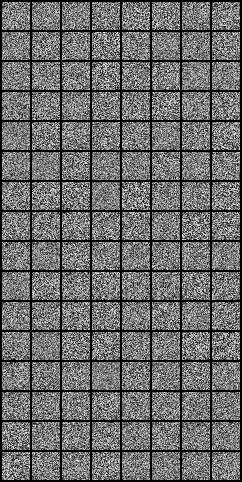

# GAN
A simple implementation based on the original paper by Goodfellow et. al.

<div style="text-align: center;">
  
</div>


## Original Model
The original models are constructed such that the generator uses a "mixture of rectifier linear activations and sigmoid activations" with the discriminator constructed with "maxout activations" and dropout. No additional information is given regarding the implementation in the original paper

GeneratorZero and DiscriminatorZero are basic implementations true to the paper without using any features that came after the original paper. It performed pretty poorly out-of-the-box, and I didn't really have the patience to tune the models or a specific training set up to stabilize training.

## Model considerations circa 2014
I built the actual model using discoveries after the original paper released. Both networks are similarly constructed as feed-forward networks. Layer depths and widths are kept small since I'm just using MNIST and were heuristically chosen.

I used a few tips from [Goodfellow's NIPS 2016 Tutorial](https://arxiv.org/abs/1701.00160) as well as the popular [```soumith/ganhacks``` repo](https://github.com/soumith/ganhacks?tab=readme-ov-file#authors).

Anecdotally, I found dropping the Maxout for LeakyReLU to be the most beneficial change, along with data normalization, as well as larger batch sizes with batch normalization the most beneficial. Otherwise the use of dropout in solely the discriminator was kept, and obviously sigmoid and tanh outputs respectively for the discriminator and the generator since MNIST was normalized for training.

### On comparative strength between generator and discriminator
Goodfellow recognizes that people tend to view a network "overpowering" another as a "bad" thing. Specifically, this often happens when the discriminator's loss decreases significantly while the generator cannot keep up. The intuition of the argument generally is that when the discriminator gets very good very quickly, the generator is unable to utilize the discriminator's consistent negative response. Imagine Gordon Ramsay telling a Hell's Kitchen contestant to confess they are, in fact, an idiot sandwich. Even worse, it is the *only* feedback given—although comedic, not very practical for the contestant to improve their dishes.

<div style="text-align:center">
    
</div>

In turn, forums and several GAN implementations argue for training a network for more steps than the other per minibatch, or even conditionally choosing which network to train based on loss values and their trajectories. You can even see myself falling prey to this with a ```GENERATOR_STEPS_PER_DISCRIMINATOR_STEP``` hyperparameter in the training script.

However, Goodfellow argues that, in theory, a discriminator should generally be more powerful than the discriminator for the generator to gain utilizable feedback \(a contestant won't improve very much if they are better than their mentor anyway...).However, he concedes that the argument stands when the loss stabilizes so much that the *gradients* collapse. Usually they go hand-in-hand, so I think the nuance Goodfellow adds is important, but not directly practical from my experience. I did fix my need for the above  hyperparameter by adjusting other odd knobs, specifically those mentioned below. So I would add to Goodfellow's advice, that it if a specific adversarial training schedule is needed (at least for basic GANs) to stabilize training, then the implementation can be more robustly improved by adjusting something else. In any case, creating any sort of specific adversarial training schedule in my experience only temporariliy stabilized training and losses stabilized (although slower) but still inevitably.

### On batch normalization
Interestingly, Goodfellow mentions that DCGAN's popularized batch normalization but they carry "unfortunate" theoretical side effects due to the varying normalization statistics per feature which is amplified on smaller, and therefore much less homogenous, minibatches. Goodfellow writes an alternative to batch normalization, *reference batch normalization*, which uses fixed means and standard deviations from a reference minibatch. He goes on about how this can then in turn overfit on such a reference minibatch, so he finally lands on *virtual batch normalization* which computes these means and std's from the union of the reference and current minibatch.

I personally witnessed qualitative improvements, but that's likely since the minibatches were relatively homogoneous with only a few classes of images in MNIST and relatively large batch sizes > 64. But I can imagine a heterogenous set of minibatches due to lots of class labels and smaller batch sizes due to hardware reistrictions. In such case, the opposite trend that Goodfellow highlighted may emerge.

### Modified loss function
The generator loss function Goodfellow highlights in the original paper for proving convergence of the generator and data distributions is slightly different from the one used in practice due to worse gradients earlier in training when the discriminator can quickly gain an edge against the discriminator.

## Unimplemented improvements
These were ommitted due to the simplicity of MNIST making these unnecessary, but more complex data can leverage these:

<ol>
<li>Label smoothing: change labels for ground truth from 1 to something between 0.9 and 1, perhaps noisily also. Important not to smooth the fake labels, otherwise it just scales the discriminator outputs</li>
<li>Conditioned generation: having the generator sample from a conditioned Gaussian (based on ground-truth labels) can create a greater separation between classes and help prevent mode collapse (when the generator neglects to learn a certain class of data)
</ol>


## Final thoughts
I found this to be pretty fun since it wasn't so difficult to implement. The original GAN with Maxout was a nightmare to train stably, but after looking at implementations online, it was apparent that the consensus was Maxout just is not practical. After getting over the hump of needing to stray away from the original paper, everything fell into place pretty quick as soon as I squashed an annoying training bug (reader be warned of torch's ```detach()```).

I hope to run more experiments to ablate some of these findings quantitatively using FID, etc., but I'd hate to waste compute on likely redundant findings, so it's unlikely.